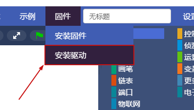
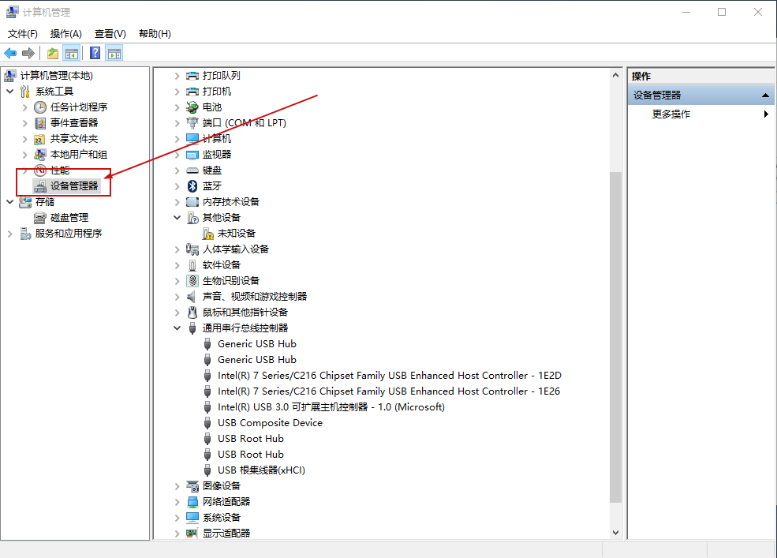
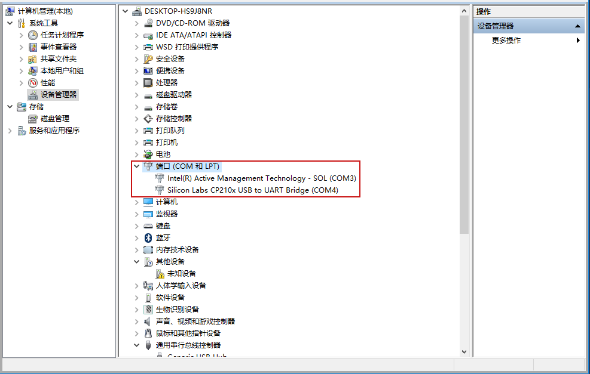

#  <center>主控无法连接问题</center>  

## 1、驱动未安装， 点击软件菜单栏上 固件 -> 安装固件
<br/>
&nbsp;&nbsp;&nbsp;&nbsp;在安装好ScratchPi之后，需要安装Arduino驱动，  点击菜单栏上 固件 -> 安装驱动
      
&nbsp;&nbsp;&nbsp;&nbsp;安装完驱动过程中，如果您电脑上安装了360安全卫士或其它电脑管家程序，该驱动可能会被拦截。  
&nbsp;&nbsp;&nbsp;&nbsp;Mac系统会自动拦截驱动，请在 `系统偏好设置` 中的 `安全性与隐私` -> `通用` 中选择`允许`
<br/>
## 2、数据线损坏， 请换一根数据线尝试重新连接，普通的安卓手机充电线就可以
<br/>
&nbsp;&nbsp;&nbsp;&nbsp;数据线在使用过程中，容易出现拉扯现象，多次拉扯可能会导致数据线内部断裂，从而在扫描串口、连接主控、安装固件或上传代码的过程中出现异常， 如果遇到这种问题，请更换一根新的数据线再次尝试使用
<br/>
## 3、电脑端口损坏，这类情况出现得比较多，换一个电脑USB端口尝试一下
<br/>
&nbsp;&nbsp;&nbsp;&nbsp;电脑的USB端口在经过多次插拔读取，非常容易损坏，导致无法识别串口，通常电脑有多个USB端口可以使用，如果遇到此类问题，请更换一个USB端口接入主控
    检查方法：
### windows系统

1、右击桌面上 "我的电脑" -> 选择``管理``   
2、打开``计算机``管理后，点击左侧栏的``端口(COM和LPT)``  
<br>

<br/>
3、检查`端口`下，是否有一个叫``Silicon Labs CP210x USB UART Bridge``的设备，括号后面是相对应的端口号,如下图所示

4、在确定已经安装驱动和数据线未损坏的情况下，如果没有这个设备，则可能是计算机端口损坏，请更换端口使用
<br>


### Mac OS X系统

1、数据线连接好主控后，打开终端，输入
```
$ ls /dev/cu.SLAB
```
2、 查看是否有一个名字叫`cu.SLAB_USB×××××`的外部设备。  

3、在确保数据线完好并已经安装驱动的情况下，如果没有发现在这个设备，请再更换一个端口使用

## 4、windowsXP系统下，软件可能会出现不可预知的错误，目前软件仅支持windows7及以上的系统，建议更新系统
<br/>
&nbsp;&nbsp;&nbsp;&nbsp;由于windowsXP系统的多版本性，某些版本经过各种破解、二次开发、定制、修改等行为，某些功能无法正常使用导致不能识别或连接主控，建议使用windows7及以上正版系统
<br/>
## 5、360安全卫士可能会与软件冲突
<br/>
&nbsp;&nbsp;&nbsp;&nbsp; 在连接主控过程中，需要获取系统管理员权限来调用计算机端口，如果开了360安全卫士，可能会拦截软件获取管理员权限。  
如遇到这类情况，请将ScratchPi软件放入`信任区`或关闭`360安全卫士`。  
请务必相信我们的软件无毒无害，绝不会对您的电脑造成任何损坏.  
<br/>
## 6、主控电池电量不足，处于关机的临界值
&nbsp;&nbsp;&nbsp;&nbsp; 在主控长时间使用之后，会把主控电池内的电量耗尽。如果出现此类问题，请进行充电后使用。

```  
  红色指示灯表示正在充电  
  蓝色指示灯表示主控以开启  
  绿色指示灯表示主控电池充满  
```

## 7、电脑运行内存太满
&nbsp;&nbsp;&nbsp;&nbsp; ScratchPi对电脑配置没有特殊要求，目前市面上绝大部分电脑都可以使用我们的软件。  
&nbsp;&nbsp;&nbsp;&nbsp;但不可避免的，如果在电脑正在运行大量程序、服务、进程，把电脑的运行内存占得太满，ScratchPi软件运行速度会变慢，甚至导致卡顿、无法启动等问题
在连接串口过程中也可能会造成一定的影响。如连接过程中出现以下报错代码提示,请关机重启，让电脑休息一下。  

```
 Opening COM3: Unknown error code 1167
 Opening COM3: Unkown error code 31
```


## 如果以上解决方案还未解决您的问题，请微信扫描下方二维码，添加我们的技术支持沟通

