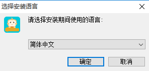
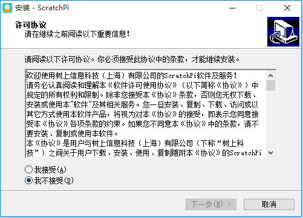

#  
软件安装

## 1、软件下载  

  [点击进入官网下载](http://www.bettertree.cn)

  点击菜单栏上的 <b>下载</b>, 进入如下界面

  

   

  根据您使用的系统，下载`windows系统`或`MacOS系统`的<b>ScratchPi稳定版</b>

  双击下载好的ScratchPi安装程序，按照以下步骤安装

  
 
选择安装时所用的语言。  
 

- 请仔细阅读许可协议后，选择``我接受``， 并点击``下一步``。
- 根据提示再次点击``下一步``。
- 根据需要，选择安装位置后，点击``下一步``。
- 再次点击``下一步``。
- 点击``安装`` 等待进度条结束，直至安装完成后点击``完成``。

### 注意事项
> 1、如果您电脑上已经安装了ScratchPi并正在运行，请关闭后在安装，否则会有冲突，可能导致安装失败

> 2、如果您电脑上已安装360安全卫士，在软件安装过程中可能会出现软件被360误报为不安全程序的问题，请务必选择信任本软件，否则软件可能无法正常运行！
