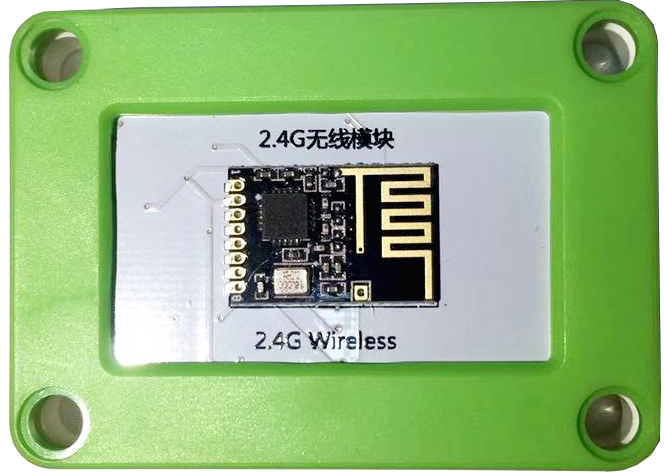
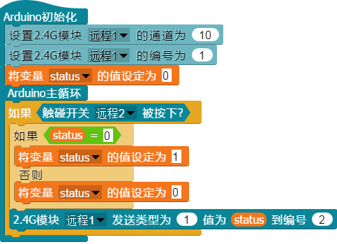
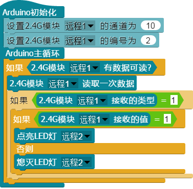

# 
2.4G无线通讯模块

### ``产品名称``： 2.4G无线通讯模块

### ``产品介绍``：

> 通过发送和接收2.4GHz频率的波段，实现主控与主控之间的通信

###  ``产品图片``：

   

### ``功能模块``：
&nbsp;&nbsp;
> 该模块用于设置2.4G模块的通信通道，在同一通道内的2.4G模块可以互相通信

&nbsp;&nbsp;
> 该模块用于设置2.4G的编号，每个2.4G模块都有单独的编号，这个编号是用于认证身份的

&nbsp;&nbsp;
> 该模块用于发送信号，发送一个信号到同一通道的指定编号

&nbsp;&nbsp;
> 检测是否有信号发送给我

&nbsp;&nbsp;
> 读取发送给我的信号

&nbsp;&nbsp;
> 读取接收到的信号是谁发送给我的

&nbsp;&nbsp;
> 获取接收到信号的类型

&nbsp;&nbsp;
> 读取接收到信号的值

### ``小案例``
> 下面程序是一个远程控制灯光的程序，实现远程控制LED灯点亮与熄灭

&nbsp;&nbsp;  
> 该程序是一个触碰开关的发送端，向通道为10，编号为2的2.4G无线通讯模块发送一个类型为1，值为变量status的信号

&nbsp;&nbsp;  
> 改程序是一个亮灯程序的接收端，如果接收到类型为1，值为1的信号，则点亮LED，否则熄灭LED灯
