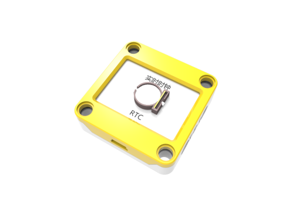
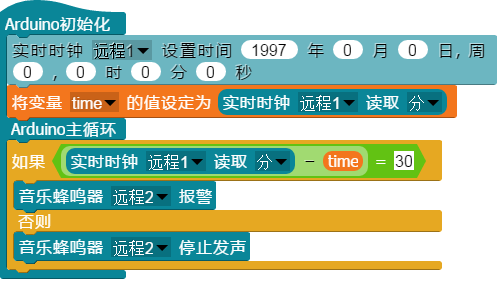

## 
实时时钟

### ``产品名称`` : 实时时钟

### ``产品介绍`` ：

>  在作品断电状态下依然持续记录时间

### ``产品图片``:

   

### ``功能模块``：

> 该模块可以设置实时时钟的初始时间，上面已有的参数代表ScratchPi软件打开的时间。可修改

> 该模块可以读取实时时钟里保存的年、月、日、周、时、分、秒等数据，每次只能读取一个值

### ``小案例``:

> 改程序为模拟闹钟程序，设定30分钟后音乐蜂鸣器报警(模拟闹钟)
