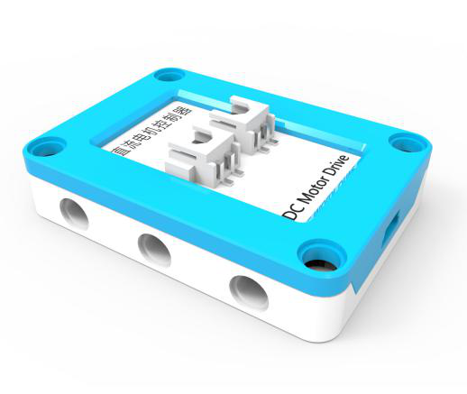
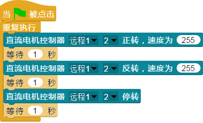

## 
直流电机控制器

### ``产品名称`` : 直流电机控制器

### ``产品介绍`` ：

>  控制直流电机、水泵的转动，一个端口可以同时控制两个电机

### ``产品图片``:

   

### ``功能模块``：

> 该模块可以控制一个电机顺时针正转，可调节转速

> 该模块可以控制一个电机逆时针反转，可调节转速

> 该模块可以控制一个电机停转

### ``产品参数``：
> 电机选择： 1 ~ 2    
> 转速： 0 ~ 255  

### ``注意事项``：

> ScratchPi中的端口选择对应电子模块中的端口，根据相对应的端口选择性接入</b>

### ``小案例``:

> 该程序可以使第二个端口接入的电机正转一秒，反转一秒，然后停止一秒之后又正转，以此往复。
