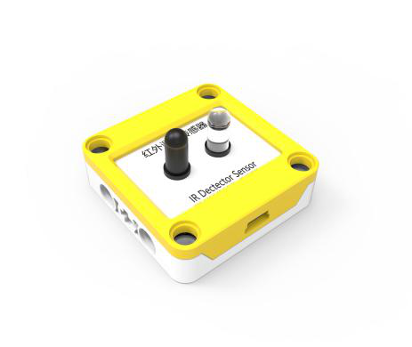
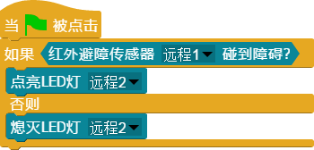

## 
红外避障传感器

### ``产品名称``: 红外避障传感器

### ``产品简介``：

> 检测前方是否有障碍物

### ``产品图片``:

   

### ``功能模块``：

&nbsp;&nbsp;&nbsp;&nbsp;  

> 该模块用于检测前方是否有障碍物

### ``注意事项``：

> 红外避障传感器上有电位器可以调节检测范围

### ``小案例``：

&nbsp;&nbsp;&nbsp;&nbsp;  

> 该程序可以在红外避障传感器检测到前方有障碍物的时候点亮LED灯
