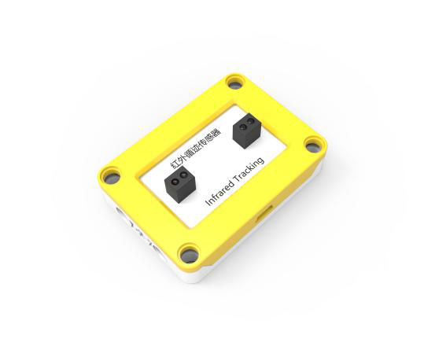
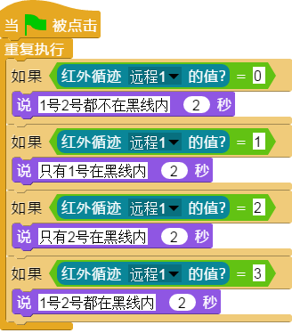

## 
红外循迹传感器

### ``产品名称``： 红外循迹传感器

### ``产品简介``：

> 通过红外线来探测是否遇到黑线

### ``产品图片``：

   

### ``功能模块``：

&nbsp;&nbsp;&nbsp;&nbsp;

> 该模块返回红外循迹传感器的状态值，  
> 1号2号都不在黑线内则值为0,
> 只有1号在黑线内则值为1，
> 只有2号在黑线内则值为2,
> 若都在黑线内则值为3.

&nbsp;&nbsp;&nbsp;&nbsp;

> 该模块用于判断1号探头和2号探头是否都不在黑线内

&nbsp;&nbsp;&nbsp;&nbsp;

> 该模块用于判断1号探头和2号探头是否都在黑线内

&nbsp;&nbsp;&nbsp;&nbsp;

> 该模块用于判断是否只有1号探头在黑线内

&nbsp;&nbsp;&nbsp;&nbsp;

> 该模块用于判断是否只有2号探头在黑线内

### ``注意事项``：

> 电子模块后方有两个可供调节的电位器，可以通过拧动电位器来调节检测范围和精度，通常默认检测范围是2个乐高单位(约1.6cm ~ 2cm)

### ``小案例``：

&nbsp;&nbsp;&nbsp;&nbsp;

> 该程序通过判断红外循迹传感器的值说出相对应的状态
