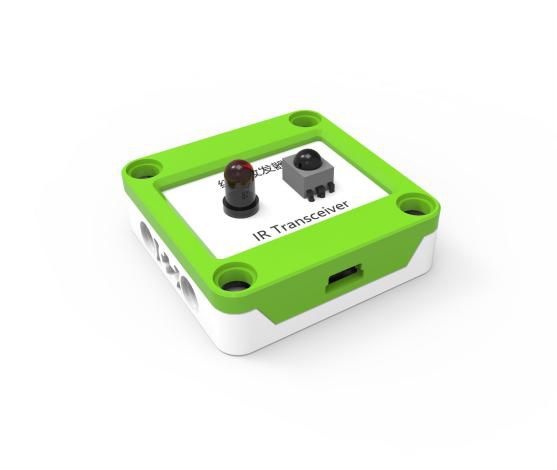
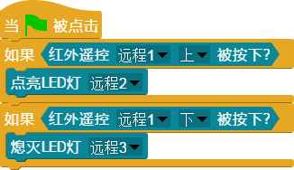

## 
 红外收发器 

### ``产品名称``： 红外收发器

### ``产品简介``：

> 实现遥控器控制、发送编码通信

### ``产品图片``：

   

### ``功能模块``：

&nbsp;&nbsp;&nbsp;&nbsp;  

> 该模块可以接受红外收发器的编码

&nbsp;&nbsp;&nbsp;&nbsp;  

> 该模块可以通过红外收发器发送编码

&nbsp;&nbsp;&nbsp;&nbsp;  

> 该模块可以接收远程遥控器的按键值

&nbsp;&nbsp;&nbsp;&nbsp;  

> 该模块可以接收红外遥控器发送的编码

### ``注意事项``：

> 注意区分编码和按键值

### ``小案例``：

&nbsp;&nbsp;&nbsp;&nbsp;  

> 该程序实现远程遥控的开灯与关灯，按`上键`则开灯，按`下键`则关灯
