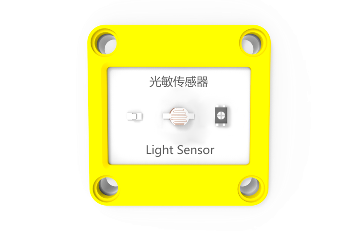
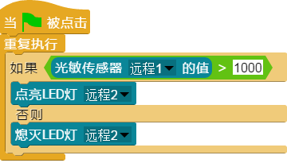

## 
光敏传感器

### ``产品名称``： 光敏传感器

### ``产品描述``：

> 用于检测光线强度

### ``产品图片``：

   

### ``功能模块``：

&nbsp;&nbsp;&nbsp;&nbsp;  

> 该模块有一个预设值，可以通过光敏传感器上的电位器调节。当前光线强度小于这个预设值时，则判断为光敏传感器检测到光

&nbsp;&nbsp;&nbsp;&nbsp;  

> 该模块可以返回当前光线强度，形成一个光敏值，光线越强则光敏值越小

### ``产品参数``：

> ``光敏值范围``：0 ~ 1023

###  ``注意事项``：
> <b color="red" >光线越强，光敏值越小<b>

### ``小案例``：

&nbsp;&nbsp;&nbsp;&nbsp;  

> 该程序根据光线强度变化控制LED灯，若光线太暗开灯
