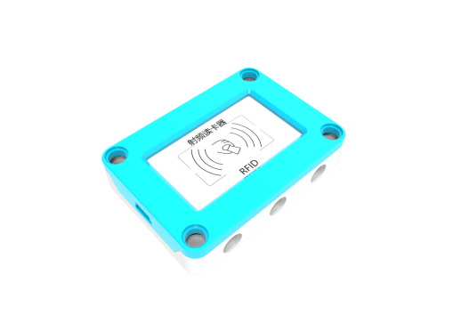
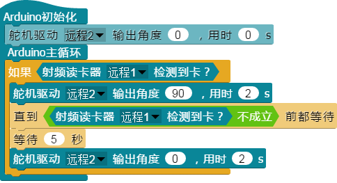

## 
射频读卡器

### ``产品名称``： 射频读卡器

### ``产品简介``：

> 精准识别RDIF卡片，对RDIF卡片进行读写操作

### ``产品图片``：

   

### ``功能模块``：

&nbsp;&nbsp;&nbsp;&nbsp;

> 该模块可以检测前方是否有RFID卡片

&nbsp;&nbsp;&nbsp;&nbsp;

> 该模块可以设置RFID卡的编号，参数为要设置的RFID卡的编号

&nbsp;&nbsp;&nbsp;&nbsp;

> 该模块可以给RFID卡写入值

&nbsp;&nbsp;&nbsp;&nbsp;

> 该模块可以读取RFID卡的编号

&nbsp;&nbsp;&nbsp;&nbsp;

> 该模块可以读取RFID卡的值

### ``小案例``：

&nbsp;&nbsp;&nbsp;&nbsp;

> 改程序是一个模拟门禁的系统，当射频读卡器检测到卡，则舵机转动九十度开门，卡片收起五秒后，舵机转回初始角度
