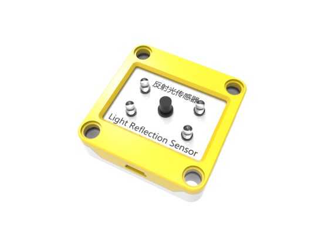
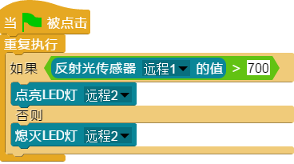

## 
反射光传感器

### ``产品名称``： 反射光传感器

### ``产品简介``：
> 通过反射光线检测前方灰度

### ``产品图片``：

   

### ``功能模块``：

&nbsp;&nbsp;&nbsp;&nbsp;  

> 该模块可以返回检测范围内的灰度值

### ``产品参数``：
>  ``取值范围``：0~1023

### ``小案例``：
&nbsp;&nbsp;&nbsp;&nbsp;

> 该程序可以在当前回复大于700的时候，点亮LED灯
