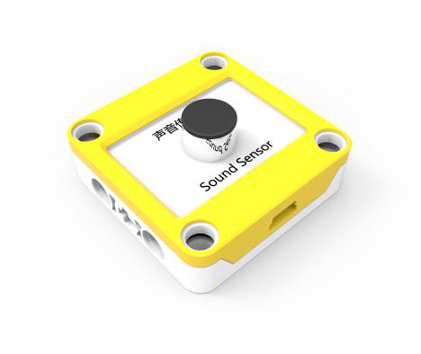
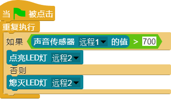

## 
声音传感器</cemter>

### ``产品名称``： 声音传感器

### ``产品简介``：

> 检测周围是否有声音以及声音的大小

### ``产品图片``：

   

### ``功能模块``：

&nbsp;&nbsp;&nbsp;&nbsp;

> 该模块可以检测到周围是否有声音

&nbsp;&nbsp;&nbsp;&nbsp;

> 该模块可以检测到声音大小并返回一个相对应的数值

### ``产品参数``：

> 声音大小： 0 ~ 1023

### ``小案例``：

&nbsp;&nbsp;&nbsp;&nbsp;

> 该程序可以实现一个类似楼道声控灯的效果，如果检测到周围的声音大小超过700则点亮LED灯，否则熄灭
