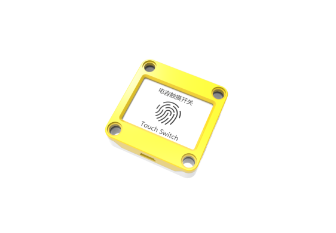
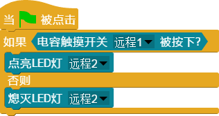

## 
电容触摸开关

### ``产品名称``： 电容触摸开关

### ``产品简介``：

> 触摸感应

### ``产品图片``：

   

### ``功能模块``：

&nbsp;&nbsp;&nbsp;&nbsp;  

> 当手指放到电容触摸开关上的时候，模块返回值为``成立``， 否则为``不成立``

### ``小案例``：

&nbsp;&nbsp;&nbsp;&nbsp;  

> 该程序运行时，按下触碰开关按钮则灯亮，松开则灯灭
