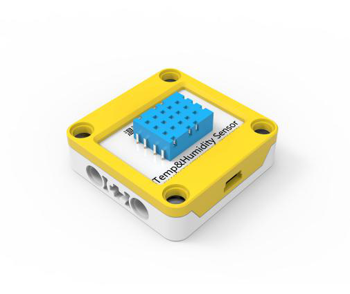

## 
温湿度传感器

### ``产品名称``：温湿度传感器

### ``产品简介``:

> 测量室内空气的温度和湿度

### ``产品图片``：

   

### ``功能模块``：

> 在ScratchPi中提供了两个程序块来分别获取温度和湿度信息

### ``产品参数``：

> 温度有效范围：0~50摄氏度  
> 湿度有效范围：20% ~ 90%

### ``注意事项``：

> 1、由于空气温湿度变化是很缓慢的，因此在测试使用时不需要太高的查询频率，几秒钟查询一次即可。  

> 2、 一定不能将温湿度传感器放在水中或者土中检测水温或土壤湿度， 该传感器没有防水保护，可能会损坏传感器。

## ``小案例``：

> 该程序可以在舞台上说出现在空气的温度和湿度
