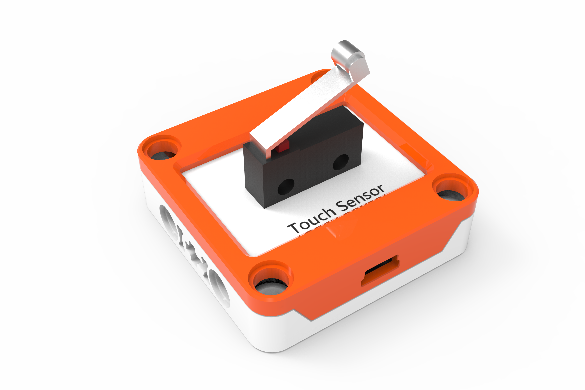

## 
 触碰开关 

### ``产品名称``：触碰开关

### ``功能介绍``：
> 通过按下触碰开关按钮来控制当前状态

### ``产品图片``：

   

### ``功能模块``：

&nbsp;&nbsp;&nbsp;&nbsp;  
> 该模块可以检测触碰开关是否被按下，根据状态返回``成立``或``不成立``

### ``小案例``：

&nbsp;&nbsp;&nbsp;&nbsp;  

> 该程序运行时，按下触碰开关按钮则灯亮，松开则灯灭
