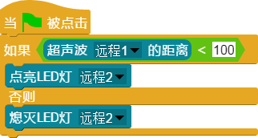

# 
 超声波 

### ``产品名称``：超声波

### ``产品介绍``：

> 超声波传感器是利用超声波的特性研制而成的传感器，常用于测量距离，如倒车雷达等。

### ``产品图片``:

   

### ``功能模块``：

&nbsp; 
> 该模块用于驱动超声波传感器测量距离前方障碍物的距离

### ``产品参数``：
``有效距离``： 2cm ~ 200cm  
``频率``： F ≥ 40KHz  

###  ``注意事项``

> 1、超声波不能直接接触障碍物，至少保持2cm的距离，否则超声波无法发出会返回1000  
> 2、前方障碍物要尽量平整，面积要足够宽阔  
> 3、距离超出200cm会出现显示1000  

### ``小案例``：
&nbsp; 

> 该程序可以在检测到前方一米处有障碍物时LED灯亮，否则熄灭
