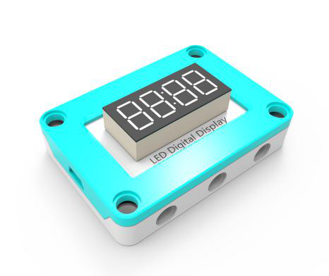
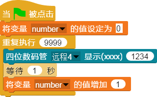

## 
四位数码管

### ``产品名称``： 四位数码管

### ``产品介绍``：

> 显示四位数的数字，显示时间

### ``产品图片``:

   

### ``功能模块``：

> 该模块可以以时间格式显示指定时间，限四位数

> 该模块可以以数字形式显示整数型数值，不包含小数点、负数

### ``产品参数``：
> 显示范围：0 ~ 9999的整数

### ``小案例``：

> 该程序可以从0~9999的数值依次显示出来
