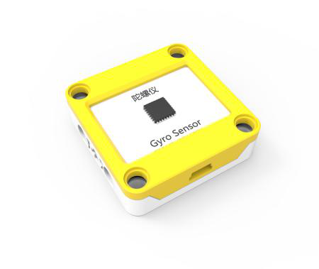
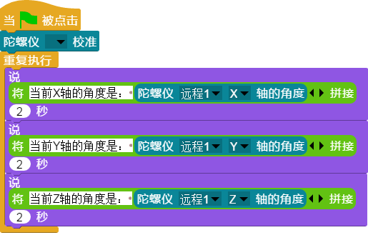

## 
陀螺仪

### ``产品名称``： 陀螺仪

### ``产品介绍``：

> 检测上下前后左右倾斜角度

### ``产品图片``：

   

### ``功能模块``：

> 该模块可以校准陀螺仪角度，以当前角度为初始角度

> 该模块以初始化角度为原点，目前各轴的倾斜角度

> 该模块可以返回陀螺仪运动过程中各轴倾斜速度的值

> 该模块可以返回陀螺仪运动过程中各角倾斜速度的值

### ``产品参数``：
> 倾斜角度： -180 ~ 180

### ``小案例``：

> 该程序可以依次在舞台显示出当前陀螺仪X轴、Y轴、Z轴的角度
