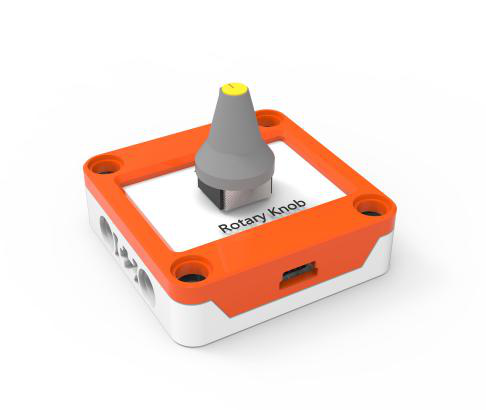
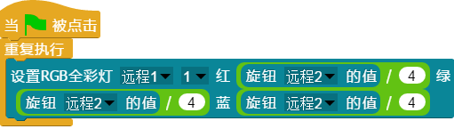

## 
旋钮

### ``产品名称``： 旋钮(电位器)

### ``产品简介``：

> 通过旋转旋钮改变值的大小

### ``产品图片``：

   

### ``功能模块``：

> 该模块可以使值随着旋钮的变化而变化

### ``产品参数``：
> 取值范围：0 ~ 1023

### ``注意事项``：
> 旋转角度为270度，旋转时不宜用力过大

### ``小案例``：

> 该程序可以实现用旋钮控制RGB灯中第一个灯的亮度，RGB灯亮度的取值范围是0~
255，旋钮的取值范围是0~1023。所以需要除以4来控制亮度范围
