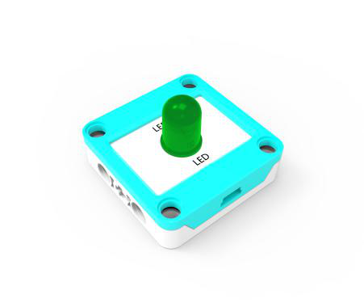
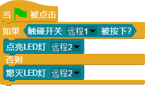

## 
 LED灯 

### ``产品名称``：LED灯

### ``产品介绍``：
  > LED灯是生活中非常常见的电子产品，大到房间的照明灯，小到电子设备上的指示灯，LED以其低功耗、小体积的优点成为照明方案的首选。同时，由于LED灯的控制非常简单，一个高低电平即可控制其亮灭，所以成了计算机控制编程的首选入门电子器件。

### ``产品图片``：
  

     
  

### ``功能模块``：

&nbsp;&nbsp;&nbsp;&nbsp;  

> 该模块用于点亮LED灯  

&nbsp;&nbsp;&nbsp;&nbsp;  

> 该模块用于熄灭LED灯

### ``LED小案例``:

> 该程序当触碰开关被按下时，LED点亮，松开则熄灭
