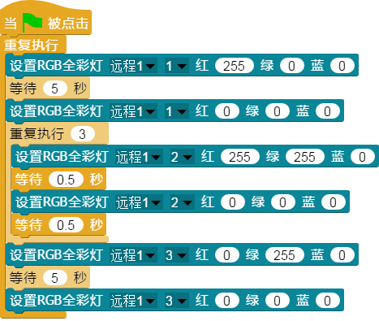

## 
 RGB全彩灯 

### ``产品名称``：RGB全彩灯

### ``产品介绍``：
  > 模块上每个灯都能发出红、绿、蓝三种颜色的灯光，亮度可调节

### ``产品图片``：
  

     
  

### ``功能模块``：

&nbsp;&nbsp;&nbsp;&nbsp;  

> 该模块用于设置各个灯的颜色、亮度  

### ``产品参数``

  ``颜色``：由三元色红、绿、蓝根据RGB值调配可以组成任意颜色  
  ``亮度``：0 ～ 255

### ``LED小案例``:

> 该程序可以实现一个红绿灯的效果，红灯5秒之后闪烁黄灯，然后变成绿灯
