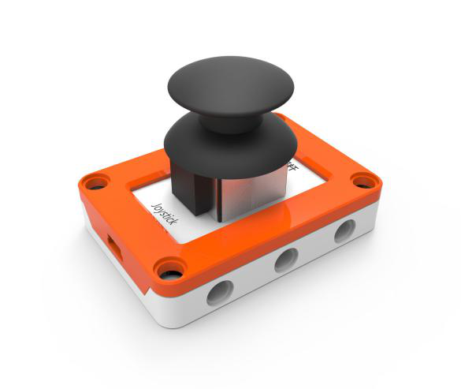
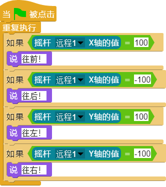

## 
摇杆

### ``产品名称``：摇杆

### ``产品简介``：

> 前后左右的摇动摇杆，往程序中输入值

### ``产品图片``：

   

### ``功能模块``：

> 该模块检测摇杆X轴的值

> 该模块检测摇杆Y轴的值

> 该模块检测摇杆是否被按下

### ``产品参数``：
> X轴： -100 ~ 100  
> Y轴： -100 ~ 100

### ``小案例``：

>该程序检测摇杆的方向，根据摇杆方向说出相对应的方向
