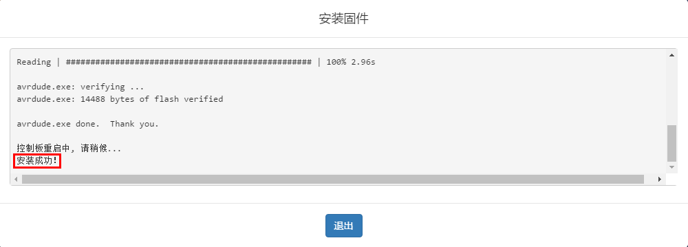

## 
Arduino模式

 点击菜单栏：模式 ->  Arduino。如下图所示

  

   

  

 切换到Arduino模式。如下图所示

  

   

  

在Arduino模式下，不支持动画等功能，左侧的舞台和角色列表等功能被禁用，在界面右侧可看到实时生成的Arduino代码。具体界面功能如图3.6.1-2所示。

相对于Scratch模式，Arduino模式可实现脱机运行，不再依赖电脑，便于作品的携带和演示，同时，Arduino模式生成的代码运行速度快，能实现一些对实时性要求很高的作品。

### Arduino 模式图形化编程
ScratchPi支持Arduino模式下通过图形化编程自动生成Arduino代码，并将代码上传烧录到远程扩展板中，实现脱机运行。

在Arduino 模式下拖动程序块，编写红绿灯程序。如下图所示

  

   

  

通过串口或者蓝牙方式连接Cubic，方法参考Scratch模式下的连接。
连接成功之后，准备上传代码。如下图所示。

  

   

  

点击上传代码按钮，上传成功。

  

   

  

### 说明：

- Arduino模式下，通过串口连接和蓝牙连接都可以实现上传代码。
- 代码上传成功之后，Cubic将不再支持Scratch通信功能，即在scratch
模式下不能使用。

### 恢复出厂固件

> 从Arduino模式切换回Scratch模式，再次使用Cubic，弹出“错误与硬件通信超时！”。

如下图所示

  

   
  
错误： 与硬件通信超时

  

通过恢复出厂固件恢复使用。具体步骤如下：

1、点击菜单栏：固件 ->  安装固件。如下图所示。

  

   
  
安装固件

  

2、安装成功，如下图所示。

  

   
  
安装成功

  

3、恢复出厂固件成功，可以在Scratch模式下使用Cubic。
