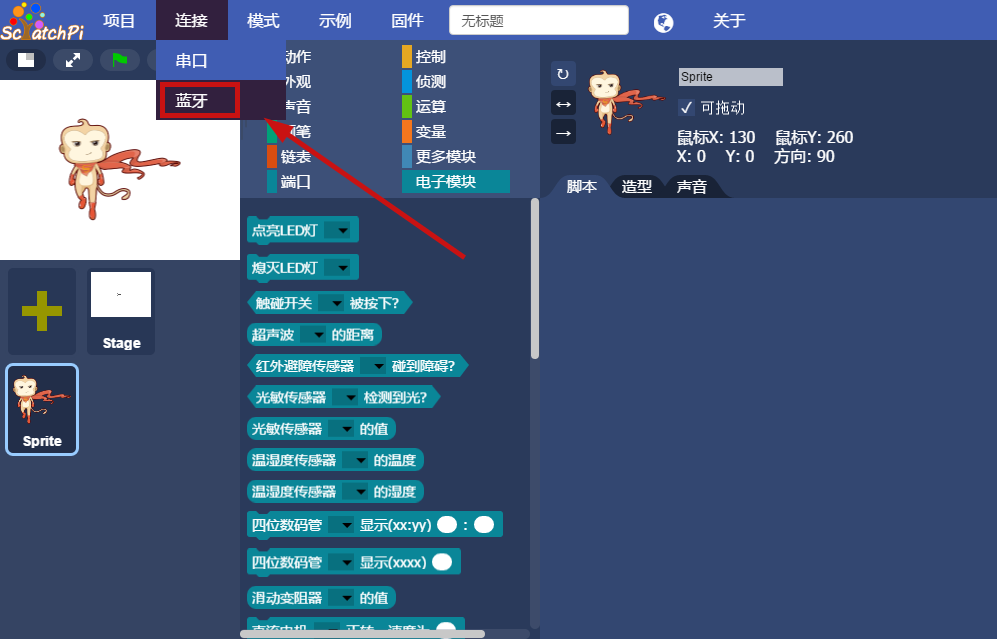
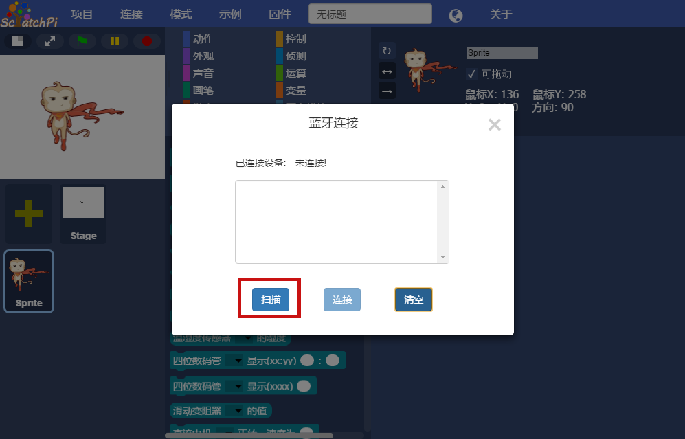
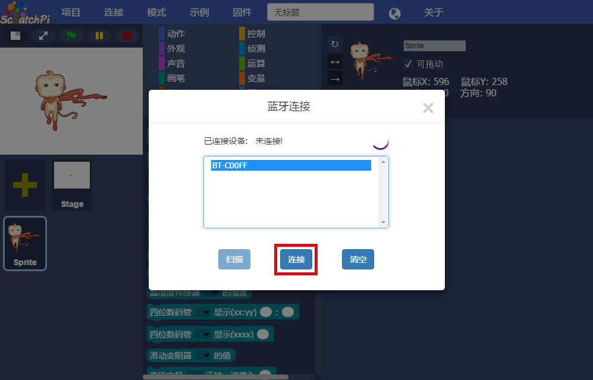
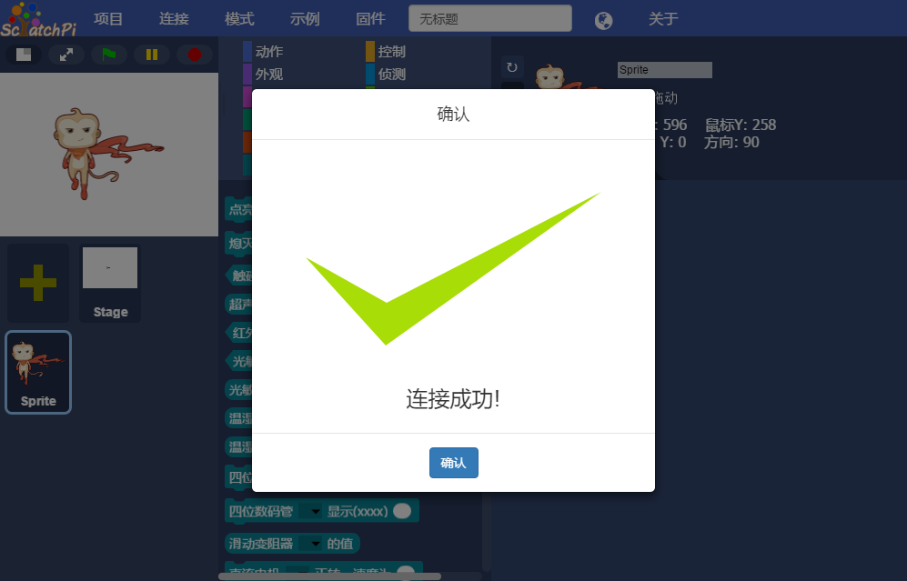

## 
蓝牙连接

点击菜单栏：连接 -> 蓝牙。如下图所示

  

   

  

 点击蓝牙，进入蓝牙连接界面。如下图所示

  

   

  

点击扫描，显示扫描到的Cubic的蓝牙名称。如下图所示

> 注意，在此步骤之前已经将Cubic打开，即蓝牙开始工作

  

   

  

选中蓝牙名称，并点击连接，连接成功。如下图所示

  

   

  

> 蓝牙连接特点：可以实现无线远程编程控制，对拼搭作品更加方便。
