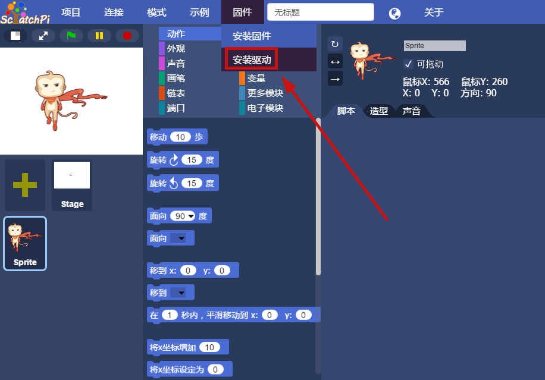
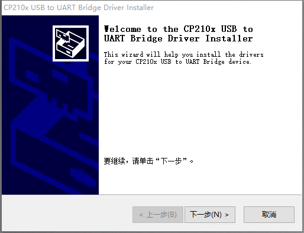
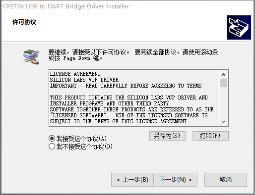
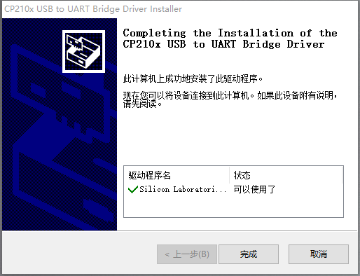
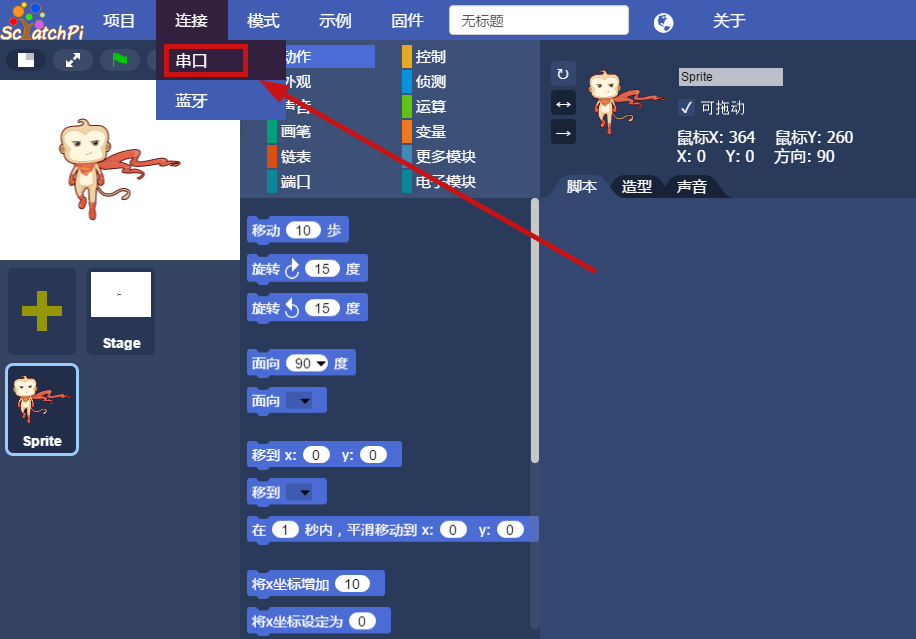
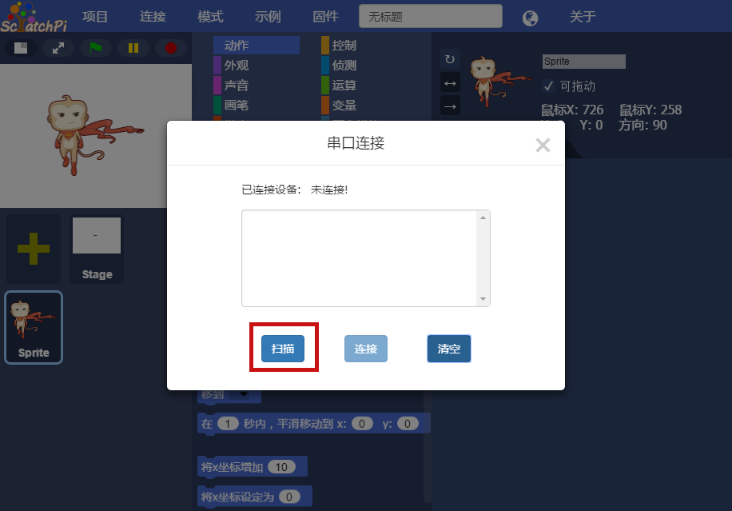
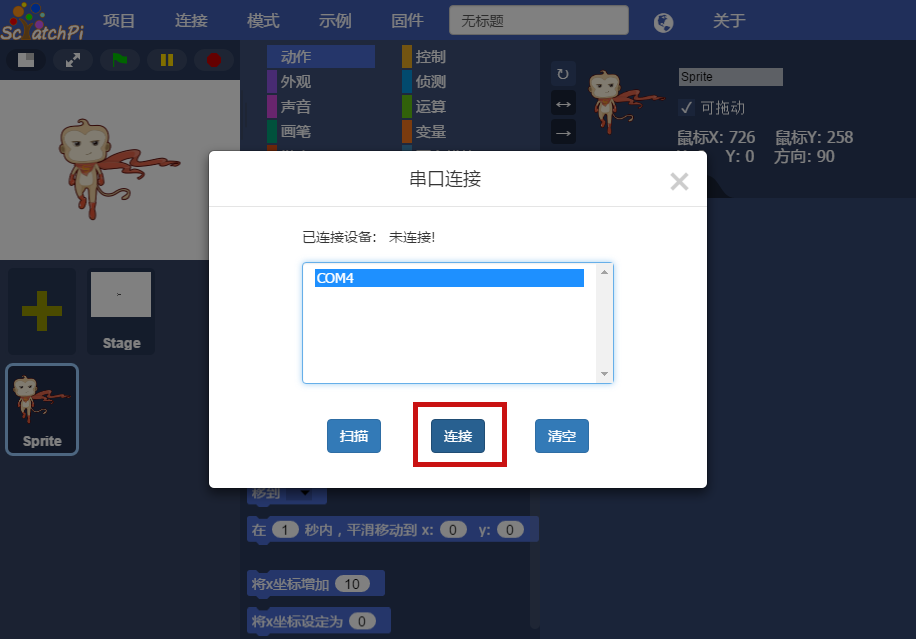
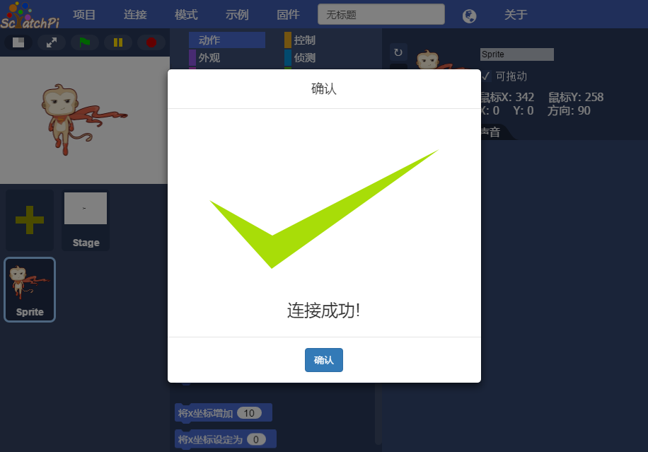

## 
串口连接

### 安装驱动

> 打开ScratchPi后， 当您需要与主控连接使用，如果之前您的电脑上没有安装过的ScratchPi, 是需要安装驱动后才能识别主控的。每台电脑只需要安装一次即可   

点击菜单栏：``固件`` -> ``安装驱动``， 如下图所示

  

   

  

进入安装向导，点击``下一步``， 如下图所示

  

   

  

进入授权许可界面，接受授权许可，点击``下一步``， 如下图所示

  

   

  

进入成功安装界面，状态一栏显示`可以使用了`就代表已经安装成功，点击``完成``退出， 如下图所示

  

   

  

> 注意事项：MacOSX系统下安装驱动的时候会有拦截，在系统偏好设置中通过 [点击进入解决方案](../)

### 串口连接

主控的侧面有一个开关，当主控开启时，主控蓝色指示灯亮起. 使用白色数据线连接电脑。

主控连接电脑USB端口后，点击菜单栏 连接 -> 串口

  

   

  

进入串口连接界面。如下图所示

  

   

  

点击扫描，显示扫描到的Cubic的串口名称。如下图所示。

>注意，在此步骤之前已经用串口线将Cubic与电脑主机连接）

  

   

  

选中串口名称，并点击连接，连接成功。如下图所示。

  

   

  

> 串口连接特点：扫描速度快，相对稳定。  
> 主控在电量不足的情况下，可能会发生连接失败的情况， 请充电后再次尝试
